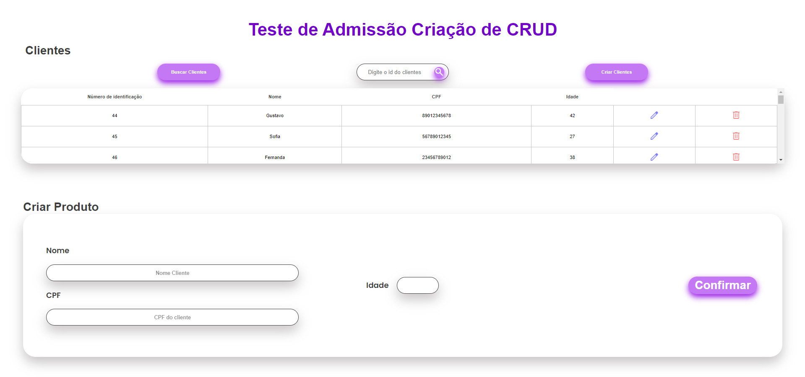

# Projeto teste de Admissão

## Visão Geral 

## Tecnologias Utilizadas

- **HTML:** 

- **CSS:** 

- **JAVASCRIPT:** 

- **JAVA:** 

- **Spring boot:** 

- **H2:** 

## Observações
- **Utilize o index.html para manipular o crud em view**

## Requisitos
1. O CRUD deve cadastrar, editar e excluir a conta do cliente
2. O cliente deve ter os seguintes campos:
a. Código do Cliente
b. Nome
c. CPF
d. Idade
## Tecnologias
● Utilize a linguagem JAVA como back-end
● O Front-End deverá ser da sua escolha
● O banco de dados também é da sua preferência, mas indicamos o H2 ou o Firebird
● Utilize os padrões DAO e DTO

## Preview

